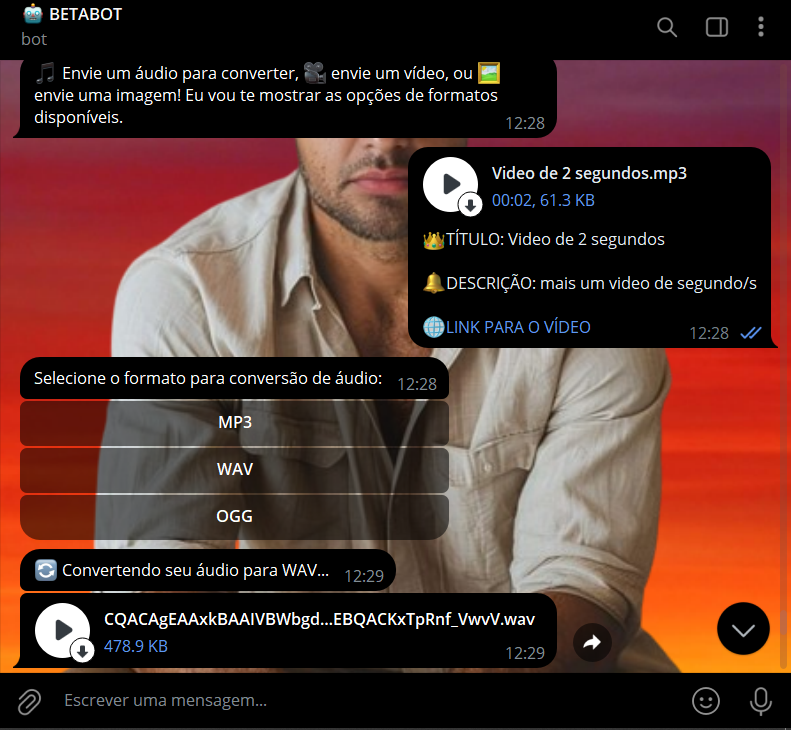
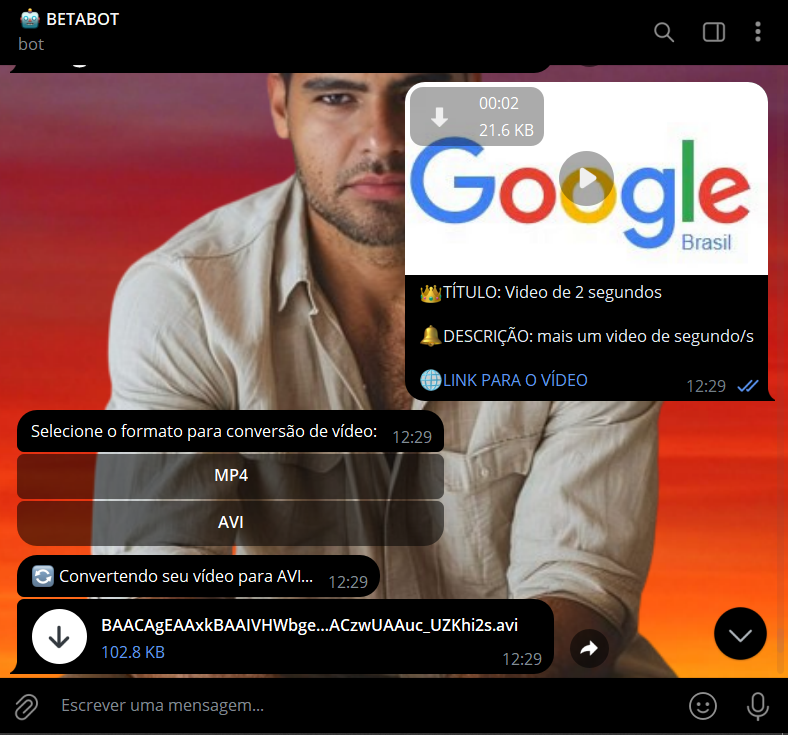

# CONVERSOR DE MIDIAS COM TELEGRAF
🤤ESSE É UM BOT DO TELEGRAM FEITO COM TELEGRAF (NODEJS/JS) QUE CONVERTE FOTOS, AUDIOS E VIDEOS!

 <br>
 <br>
 <br>

## DESCRIÇÃO:
Este bot é projetado para converter mídias enviadas pelos usuários para diferentes formatos. Ele suporta conversões para:

1. **Áudio**: Converte áudios para os formatos MP3, WAV e OGG.
2. **Vídeo**: Converte vídeos para os formatos MP4 e AVI.
3. **Imagem**: Converte imagens para os formatos JPG, JPEG, PNG e ICO.

## FUNCIONALIDADES:
1. **Início do Bot**:
   - Quando você inicia o bot (por exemplo, enviando `/start`), ele envia uma mensagem com instruções sobre como usar o bot.

2. **Envio de Áudio**:
   - Se você envia um áudio para o bot, ele oferece opções para converter o áudio para MP3, WAV ou OGG.
   - Após selecionar o formato desejado, o bot processa a conversão e envia o arquivo convertido.

3. **Envio de Vídeo**:
   - Se você envia um vídeo, o bot oferece opções para converter o vídeo para MP4 ou AVI.
   - Após selecionar o formato desejado, o bot realiza a conversão e envia o vídeo convertido.

4. **Envio de Imagem**:
   - Se você envia uma imagem, o bot oferece opções para converter a imagem para JPG, JPEG, PNG ou ICO.
   - Após selecionar o formato desejado, o bot processa a conversão e envia a imagem convertida.

## EXECUTANDO O PROJETO:
1. **Instalar o FFmpeg**:
   Primeiro, você precisa instalar o **FFmpeg** no seu sistema, caso ainda não tenha. Ele será utilizado para converter os arquivos.

   - No Linux (Ubuntu/Debian):
     ```bash
     sudo apt update
     sudo apt install ffmpeg
     ```

   - No macOS (usando Homebrew):
     ```bash
     brew install ffmpeg
     ```

   - No Windows:
     Baixe o [FFmpeg](https://ffmpeg.org/download.html), extraia os arquivos, e adicione o caminho dos executáveis às variáveis de ambiente.

2. **Editar o código:**
   - Certifique-se de substituir "seu_token_aqui" pelas informações corretas das suas credenciais em `CODIGO/.env`, o qual pode ser obtido por meio do [@BotFather](https://t.me/BotFather).
   
3. **Instalando as Depêndencias:**
   - Para instalar as dependências listadas no arquivo "package.json", você pode usar o comando `npm install` no terminal. Certifique-se de estar no diretório do seu projeto onde o arquivo "package.json" está localizado (`CODIGO`). O npm irá ler o arquivo "package.json" e instalar todas as dependências listadas nele. 

   ```bash
   npm install
   ```

4. **Inicie o Bot:**
   - Para usar o `NODE`, inicie o bot com o seguinte comando:
    ```bash
    npm start
    ```

    - Para usar o `NODEMON`, inicie o bot com o seguinte comando:
    ```bash
    npm test
    ```

5. **Interagindo com o Bot:**
   1. **Inicie uma conversa com o bot**:
      - Envie `/start` para começar a interagir com o bot. Ele lhe dará instruções sobre como enviar diferentes tipos de mídia.

   2. **Envie o tipo de mídia**:
      - **Áudio**: Envie um arquivo de áudio.
      - **Vídeo**: Envie um arquivo de vídeo.
      - **Imagem**: Envie uma imagem.

   3. **Escolha o formato de conversão**:
      - Após o envio da mídia, o bot irá perguntar qual formato você deseja para conversão.
      - Clique no botão correspondente ao formato desejado.

   4. **Receba o arquivo convertido**:
      - O bot processará a conversão e enviará o arquivo convertido de volta para você.

## NÃO SABE?
- Entendemos que para manipular arquivos em muitas linguagens e tecnologias relacionadas, é necessário possuir conhecimento nessas áreas. Para auxiliar nesse aprendizado, oferecemos cursos gratuitos disponíveis:
* [CURSO DE TELEGRAF](https://github.com/VILHALVA/CURSO-DE-TELEGRAF)
* [CURSO DE JAVASCRIPT](https://github.com/VILHALVA/CURSO-DE-JAVASCRIPT)
* [CURSO DE NODEJS](https://github.com/VILHALVA/CURSO-DE-NODEJS)
* [CONFIRA MAIS CURSOS](https://github.com/VILHALVA?tab=repositories&q=+topic:CURSO)

## CREDITOS:
- [PROJETO CRIADO PELO VILHALVA](https://github.com/VILHALVA)

